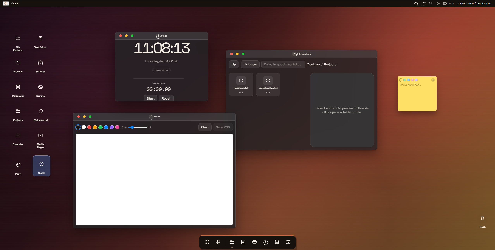

## WebOS

This is my first OS programmed entirely by me! It runs entirely on the web and stores files, settings, notes, wallpapers, accounts and many others in the browser's local storage.



## How this was made

For this project i used React 18 and native ES modules for all the JS files, so they are readable in the source code but in fact the get merged into one big file after you open the site

## How to run

To run this locally you need to: 
1. Clone the repository
```sh
git clone https://github.com/HexFud/WebOS.git
```

2. Go into the cloned folder 
```sh
cd WebOs
```
 
3. Start the server 
```sh
python3 serve.py
```

4. Visit the URL displayed in the terminal `http://localhost:8000` on your browser

To run this on the go you can visit the online version of the [WebOS](https://hexfud.github.io/WebOS/) 

## Limitations of the OS 

- The integrated browser cannot access some sites like Google because of their security policies

- In some browsers the storage may not work because of the browser's privacy settings 

## Note

If you visit the WebOS site and after a commit it seems to be exactly as before you need to hit CTRL+SHIFT+R to clean the site cache

## AI declaration

For this project i used almost no AI, it only helped me to build the initial structure of the OS
